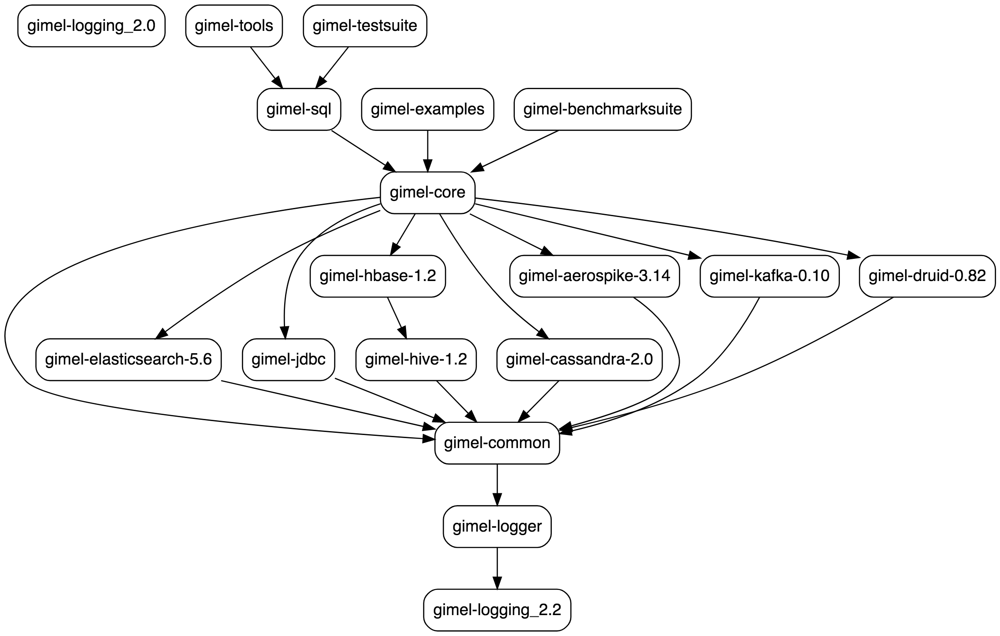

* [Build Gimel](#build-gimel)
* [Getting Gimel](#get-gimel)
    * [Components](#components)
    * [Refer as Maven Dependency](#refer-as-maven-dependency)
    * [Download library from Nexus](#download-library-from-nexus)
* [Data API Usage](#data-api-usage)


--------------------------------------------------------------------------------------------------------------------


# Build Gimel

## How to Build using Maven

Clone git repository
```bash
git clone git@github.com:paypal/gimel.git
OR
git clone https://github.com/paypal/gimel.git
cd gimel
```

Run below command to build
(-T 8 is to run 8 tasks in parallel; reduces the build time considerably)

| Profile | Command | Notes |
| -------- | -------- | -------- |
| Default | ```build/gimel install -T 8 -B``` | Recommended. Builds with all dependencies pulled from maven central |
| General | ```build/gimel install -T 8 -B -Pgeneral``` | Builds with all dependencies pulled from maven central |
| HWX releases | ```build/gimel clean install -T 8 -B -Phwx-2.6.3.11-1``` | Builds with all dependencies pulled from horton works repo if available |
| Stand Alone | ```build/gimel clean install -T 8 -B -Pstandalone``` | Builds gimel with scala packages bundled in jar, used for standalone execution of gimel jar / polling services |


--------------------------------------------------------------------------------------------------------------------


# Get Gimel

## Components

| Component | Purpose |
| -------- | -------- |
| gimel-tools | Tools (core + sql + runnables such as copyDataSet, etc) |
| gimel-sql | SQL Support (core + Gimel-SQL Functionality) |
| gimel-core | Core (Contains All Connectors, the Unified Data API) |

## Refer as Maven Dependency

### Tools
```xml
    <dependency>
      <groupId>com.paypal.gimel</groupId>
      <artifactId>gimel-tools</artifactId> <!--Refer one of the below listed 3 versions, depending on the required spark version -->
      <version>1.2.0</version> <!--provides spark 2.2.0 compiled code-->
      <scope>provided</scope> <!--Ensure scope is provided as the gimel libraries can be added at runtime-->
    </dependency>
```
### SQL
```xml
    <dependency>
      <groupId>com.paypal.gimel</groupId>
      <artifactId>gimel-sql</artifactId> <!--Refer one of the below listed 3 versions, depending on the required spark version -->
      <version>1.2.0</version> <!--provides spark 2.2.0 compiled code-->
      <scope>provided</scope> <!--Ensure scope is provided as the gimel libraries can be added at runtime-->
    </dependency>
```
### Core
```xml
    <dependency>
      <groupId>com.paypal.gimel</groupId>
      <artifactId>gimel-core</artifactId> <!--Refer one of the below listed 3 versions, depending on the required spark version -->
      <version>1.2.0</version> <!--provides spark 2.2.0 compiled code-->
      <scope>provided</scope> <!--Ensure scope is provided as the gimel libraries can be added at runtime-->
    </dependency>
```

--------------------------------------------------------------------------------------------------------------------

# Data API Usage

Quick Starter for DataSet and DataStream APIs.
Please refer individual storage system documentation for details.

```scala

import com.paypal.gimel._
import org.apache.spark.sql._
import scala.collection.immutable.Map

// Initiate DataSet
val sparkSession = SparkSession.builder().enableHiveSupport().getOrCreate()
val dataSet = DataSet(sparkSession)

// Read Data
val readOptions = Map[String,Any]()
val data1 : DataFrame = dataSet.read("pcatalog.table1",readOptions)
val data2 : DataFrame = dataSet.read("pcatalog.table2")

// Write Data
val writeOptions = Map[String,Any]()
dataSet.write("pcatalog.table3",data1,writeOptions)
dataSet.write("pcatalog.table4",data2)

// Initiate DataStream
val dataStream = DataStream(sparkSession)

// Get Reference to Stream
  val streamingResult: StreamingResult = dataStream.read(datasetName)
  // Clear CheckPoint if necessary
  streamingResult.clearCheckPoint("some message")
  // Helper for Clients
  streamingResult.dStream.foreachRDD { rdd =>
    val count = rdd.count()
    if (count > 0) {
      /**
        * Mandatory | Get Offset for Current Window, so we can checkpoint at the end of this window's operation
        */
      streamingResult.getCurrentCheckPoint(rdd)
      /**
        * Begin | User's Usecases
        */
      // dataSet.write("pcatalog.targetDataSet",derivedDF)
      streamingResult.saveCurrentCheckPoint()
    }
  }
  // Start the Context
  dataStream.streamingContext.start()
  dataStream.streamingContext.awaitTermination()
```

--------------------------------------------------------------------------------------------------------------------

# Gimel Modules (UML)

Below is the dependency graph of Gimel Modules.


