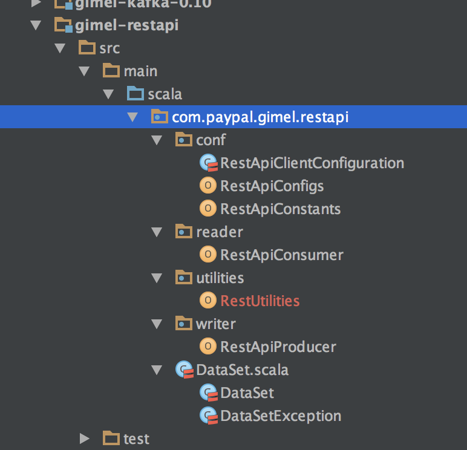
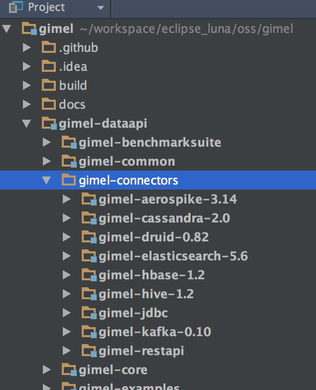

Contents
=================

We are going to walk through the steps of adding a new connector, using an [Example](https://github.com/paypal/gimel/pull/93).

* [Anatomy of a Connector's module](#anatomy-of-a-connector's-module)
* [Adding a new connector](#adding-a-new-connector)
* [Documenting the new connector](#documenting-the-new-connector)
* [Adding Standalone Support](#adding-standalone-support)
* [Testing the new connector](#testing-the-new-connector)
* [Raising a pull request](#final-step---raise-a-pull-request)

______________________________________________________________________________________________________________________

## Anatomy of a Connector's module

Before we start adding a new connector, lets look at the various components in a connector.

Lets assume `restapi` as a sample connector. A connector typically has following packages -

  

* `com.paypal.gimel.restapi.reader` - This _MANDATORY_ package has the Reader Facade, but not the entire implementation in same file.
* `com.paypal.gimel.restapi.writer` - This _MANDATORY_ package has the write Faced, not the entire implementation in same file.
* `com.paypal.gimel.conf` - This _MANDATORY_ package should have 3 specific Classes Only. Continue reading for more details.
* `com.paypal.gimel.utilities` - This _optional_ package is where the heavy lifting code is implemented. The developers have the freedom to organized the code base as desired, provided it meets general coding practices in Java/Scala.

##### `com.paypal.gimel.restapi.conf`

* `com.paypal.gimel.restapi.conf.RestApiClientConfiguration` - All references to members inside the Connector are to be initiated, defaulted or resolved here.
* `com.paypal.gimel.restapi.conf.RestApiConfigs` - All the parameters that are exposed to client are listed here.
* `com.paypal.gimel.restapi.conf.RestApiConstants` - All the non-parameter constants are defined here.
* [Example](https://github.com/paypal/gimel/tree/master/gimel-dataapi/gimel-connectors/gimel-restapi/src/main/scala/com/paypal/gimel/restapi/conf)

##### `com.paypal.gimel.restapi.reader`

* `com.paypal.gimel.restapi.reader.RestApiConsumer` - the connector's API that is exposed to the `DataSet` class, method `read`
* [Example](https://github.com/paypal/gimel/pull/93/files#diff-6d8660cd3d5b05ea12c5c31f95943f30R36)

##### `com.paypal.gimel.restapi.writer`

* `com.paypal.gimel.restapi.reader.RestApiProducer` - the connector's API that is exposed to the `DataSet` class, method `write`
* [Example](https://github.com/paypal/gimel/pull/93/files#diff-52e8cb7575c9d0d949ee030629f7adbe)

##### `com.paypal.gimel.restapi.utilities`

* `com.paypal.gimel.restapi.utilities.*` - If the connector has heavy implementation, then place all the logic in this package.
* [Example](https://github.com/paypal/gimel/tree/master/gimel-dataapi/gimel-connectors/gimel-kafka-0.10/src/main/scala/com/paypal/gimel/kafka/utilities)

______________________________________________________________________________________________________________________

## Adding a new connector

### Create New Module

* Gimel Connectors are all inside the module `gimel-dataapi/gimel-connectors`.

  

* Under module `gimel-dataapi/gimel-connectors` - add a new maven module.
* In the new module, add reference to parent pom of module `gimel-dataapi`.
* Refer this pom file for example of adding the rest-api connector. [Example](https://github.com/paypal/gimel/pull/93/files#diff-8a230d9cc305bf5af358c2618b90515f)

______________________________________________________________________________________________________________________

### Including the new module `gimel-dataapi/gimel-connectors/new_connector` as part of the parent module `gimel-dataapi`

* Under parent module POM `gimel-dataapi` - add the new connector module's reference.
* Refer this pom for how a new connector is referenced in the parent pom - so it becomes a part of the build. [Example](https://github.com/paypal/gimel/pull/93/files#diff-df33deec031554f203ddf2af33caf3e9R49)
* Build gimel to ensure the new connector builds as part of the gimel project. [Building Gimel](https://github.com/paypal/gimel/blob/master/docs/getting-started/build-gimel.md)

______________________________________________________________________________________________________________________

### Add the new module `gimel-dataapi/gimel-connectors/new_connector` as a dependency for module `gimel-dataapi/gimel-core`

* [Example](https://github.com/paypal/gimel/pull/93/files#diff-8cdabaef46a85adb17e05a36d48f86e4R128)

______________________________________________________________________________________________________________________

### Include the connector in core api - `DataSet`

* Add a new value to the DataSet.Type enum. [Example](https://github.com/paypal/gimel/pull/93/files#diff-13fbc41f786ca334459a1b3294494317R43)
* Add a new reference to `NEW_STORAGE` string, say `RESTAPI` in case of restapi connector [Example](https://github.com/paypal/gimel/pull/93/files#diff-13fbc41f786ca334459a1b3294494317R386)
* Add a call to the core DataSet API in the DataSet Factory - `new com.paypal.gimel.restapi.DataSet(sparkSession)` [Example](https://github.com/paypal/gimel/pull/93/files#diff-13fbc41f786ca334459a1b3294494317R425)

______________________________________________________________________________________________________________________

## Documenting the new connector

* Place any referring images (_must be a .png_) under directory - `docs/images`. _Images must be pull from official sites._
* Add a new markdown file to `docs/gimel-connectors`. [Example](https://github.com/paypal/gimel/blob/master/docs/gimel-connectors/restapi.md)
* Add a reference to the above markdown file in `docs/index.md`. [Example](https://github.com/paypal/gimel/pull/93/files#diff-1a523bd9fa0dbf998008b37579210e12R30)

______________________________________________________________________________________________________________________

## Adding Standalone Support

* To support local testability, you may also add a docker container support for the new storage.
* Refer this yaml file to see examples of docker support for several storages. [Docker Example](https://github.com/paypal/gimel/blob/master/gimel-dataapi/gimel-standalone/docker/docker-compose.yml)
* This is highly RECOMMENDED as it provides capability to test the entire connector's feature - locally.

______________________________________________________________________________________________________________________

## Testing the new connector

### General Note

* Ensure that following components are tested, and also that results are captured in pull request.
1. `DataSet.read`
2. `DataSet.write`
3. `com.paypal.gimel.sql.GimeQueryProcessor.executeBatch()`
4. `Options` in both read & write API are working fine in following modes -
- sql mode - `set key=value`
- api mode - `dataset.read("dataset_name",options)`
5. [CatalogProvider](../gimel-catalog/catalog-provider.md) must be tested in following modes -
- `gimel.catalog.provider=HIVE`
- `gimel.catalog.provider=USER`

* The test results should be shared in a way that is clear for reviewers replicate the testing locally.

### Testing locally

Refer http://try.gimel.io to quickstart gimel in local mode - so you can test the entire API on laptop.

______________________________________________________________________________________________________________________

## Final Step - Raise a pull request

* Once you are past above listed steps, raise a PR.
* When you raise a new PR - you will see the guidelines for a PR.
* Here is the example PR for the `restapi` connector. [Example](https://github.com/paypal/gimel/pull/93)

