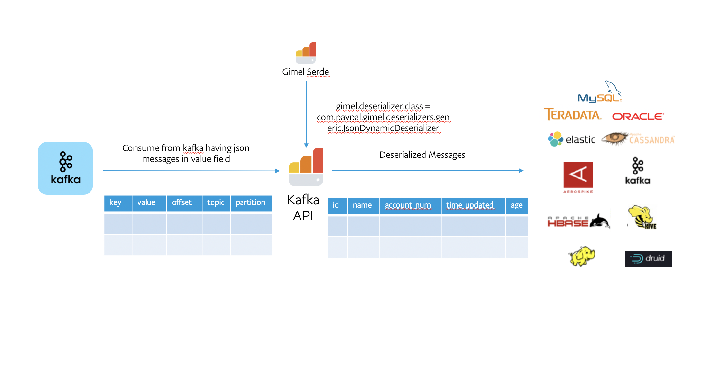

* [Kafka 2 API](#kafka-api)
  * [Note](#note)
  * [Limitations](#limitations)
  * [Batch & Streaming Features](#batch-&-streaming-features)
  * [Catalog Properties](#catalog-properties)
  * [Scale Kafka API](#scale-kafka-api)
  * [Set Catalog Provider and Dataset Properties](#set-catalog-provider-and-dataset-properties)
  * [Kafka API - Read & Write in Format - Avro](#generic-kafka-integration--data-published-as-avro-serialized-messages)
  * [Kafka Streaming API - Read & Write](#read-your-kafka-topic-via-kafkadatastream-using-structured-streaming)
  * [Kafka API - Read & Write in Format - String | JSON | Binary](#simple-kafka-topic-with-string--json--binary-messages)
  * [Read data from Kafka Custom Offset Ranges](#read_data_from_kafka_custom_offset_ranges)
  * [Load Kafka properties with custom kafka options loader](#load-kafka-properties-with-custom-kafka-options-loader)

--------------------------------------------------------------------------------------------------------------------


# KAFKA 2 API
- It supports Structured Streaming API for consuming/producing messages to/from kafka.
- This API is backward compatible with Kafka 1 connector. 
    
 

## Note

|    Format     | Support                | Differentiating Property |
| ------------- | -----------------------|---------------------------|
| AVRO | Supports READ + WRITE  | 'gimel.kafka.avro.schema.string'='<avroSchemaInJSONFormat>' |
| STRING | Supports READ + WRITE | 'gimel.kafka.message.value.type'='string' |
| JSON | Supports READ + WRITE | 'gimel.kafka.message.value.type'='json' |
| BINARY | Supports READ + WRITE | 'gimel.kafka.message.value.type'='binary' |

--------------------------------------------------------------------------------------------------------------------


## Limitations

* Supports Datastream write only for Elastic Search and Kafka
* Supports Datastream read only for Kafka

--------------------------------------------------------------------------------------------------------------------


## Batch & Streaming Features

### Checkpointing
* Save The CheckPoint States in Supplied or a Default ZooKeeper.
* Clear the CheckPoint and start over from the beginning via function calls.

### Throttling
* Advanced parameters to consume data from Kafka via Parallelism (Batch only)
* Horizontal Scaling for tasks/executors
* Control Number of messages per executor (Batch only)
* Ability to Control the Number of rows/messages to fetch from kafka in each run. (Batch only)

### Batch & Streaming SQL on Kafka with checkpointing & throttling capabilities
* Express your entire logic in SQL that can combine various datasets from storages such as Hive, HDFS, ES, Kafka
* Explore Data by "select statements"
* Insert Data into Targets by "insert statements" --> On Successful Insert : Consumer's Kafka States are Saved Implicitly in CheckPoint Nodes in Zookeeper

### Gimel Serde
* Supports loading external deserializer and serializer class on runtime to add custom logic for processing the messages in kafka.
* Generic serializers/deserializers like avro, string and json are provided in the module gimel-serde

--------------------------------------------------------------------------------------------------------------------

## Catalog Properties

### Common Props
| Property | Mandatory? | Description | Example | Default |
|----------|------------|-------------|------------|-------------------|
| bootstrap.servers | Y | the broker list for kafka | host1:9092,host2:9092 | |
| gimel.kafka.whitelist.topics | Y | comma separated list of the topic names in kafka | flights,flights_demo | |
| zookeeper.connection.timeout.ms | Y | ZooKeeper Time out Millisec | 10000 | |
| gimel.kafka.checkpoint.zookeeper.host | Y | Zookeeper host where the kafka offsets will be checkpointed for each application | localhost:2181 | |
| gimel.kafka.checkpoint.zookeeper.path | Y | The root note in ZK for checkpointing, additional child paths will be appended based on spark.app.name, spark.user, datasetName to get uniqueness of Zk Node | /gimel/kafka/checkpoints | |
| gimel.kafka.custom.offset.range | N | The Custom Offset/Partiton range to getch from a Kafka Topic | [{\"topic\": \"flights\",\"offsetRange\": [{\"partition\": 0,\"from\": 0,\"to\": 5}]}] | |
| gimel.kafka.source.fields.list | N | The list of kafka source fields | key,value,offset or all | value |
| gimel.kafka.api.version | N | Kafka API Version | 1 or 2 | 2 |

### Batch Props
| Property | Mandatory? | Description | Example | Default |
|----------|------------|-------------|------------|-------------------|
| gimel.kafka.throttle.batch.fetchRowsOnFirstRun | N | The number of last N messages to fetch, if consumer is pulling data first time ever. | 25000000 | 25000000 |
| gimel.kafka.throttle.batch.maxRecordsPerPartition | N | Total Number of Records that will be limited per partition in the Kafka Topic | 10000000 | 10000000 |
| gimel.kafka.throttle.batch.parallelsPerPartition | N | <br>This is a very advanced option to Parallelize the number of connections per Partition.<br>It is best left defaulted. The configuration was introduced during troubleshooting & Performance optimization.<br> | 250 | 250 |
| gimel.kafka.throttle.batch.minRowsPerParallel | N | <br>This is to ensure we do not over subscribe to parallelism & cause very few records to be processed per executor.<br>For instance : providing 100000 messages will be read at minimum from each executor.<br> | 100000 | 100000 |

### Streaming Props
| Property | Mandatory? | Description | Example | Default |
|----------|------------|-------------|------------|-------------------|
| gimel.kafka.throttle.streaming.isParallel | N | <br>Use in Streaming Mode to parallelize the steps where deserialization happens<br>this feature is recommended if preserving ordering is not a necessity in the sink (like HDFS)<br>Once messages are fetched from kafka, with this flag turned ON, messages can be repartition across executors to process data in parallel via below listed properties<br> | false | true |
| gimel.kafka.throttle.stream.parallelism.factor | N | The number of executors / repartitions to create while deserializing. | 10 | 10 |
| gimel.kafka.throttle.streaming.maxOffsetsPerTrigger | N | Maximum Offsets per trigger | None | 3600 |


### Kafka 1 props (Backward compatible)
| Property | Mandatory? | Description | Example | Default |
|----------|------------|-------------|------------|-------------------|
| key.serializer | Y | the kafka key serializer | | org.apache.kafka.common.serialization.StringSerializer |
| value.serializer | Y | the kafka message serializer | org.apache.kafka.common.serialization.StringSerializer | org.apache.kafka.common.serialization.ByteArraySerializer |
| key.deserializer | Y | the kafka key DeSerializer | | org.apache.kafka.common.serialization.StringDeserializer |
| value.deserializer | Y | the kafka message DeSerializer | org.apache.kafka.common.serialization.StringDeserializer | org.apache.kafka.common.serialization.ByteArrayDeserializer |
| gimel.kafka.avro.schema.source | Y | <br>INLINE - indicates avro schema is supplied via gimel.kafka.avro.schema.string<br>CSR - picks up schema from confluent schema registry based on gimel.kafka.avro.schema.source.url<br> | |
| gimel.kafka.avro.schema.string | N | This is a Must if `gimel.kafka.avro.schema.source=INLINE` | Refer Examples below for Avro Data | |
| gimel.kafka.avro.schema.source.url | N | This is a Must if `gimel.kafka.avro.schema.source=CSR` | Refer Examples below | |
| gimel.kafka.avro.schema.source.key | N | This is a Must if `gimel.kafka.avro.schema.source=CSR`, the key to lookup confluent schema registry | Refer Examples below for Avro Data | |

--------------------------------------------------------------------------------------------------------------------

## Scale Kafka API
- By default the property gimel.kafka.throttle.batch.minRowsPerParallel is set to 100k, this means each spark partition will process 100k records.
- If gimel.kafka.throttle.batch.maxRecordsPerPartition is set to more than gimel.kafka.throttle.batch.minRowsPerParallel, it will divide the records in each kafka partition.
- It removes the dependency upon number of kafka partitions for parallelism in the spark job.

--------------------------------------------------------------------------------------------------------------------
## Spark Shell command to test the examples below

```bash
spark-shell --jars 
gimel-tools-2.0.0-SNAPSHOT-uber.jar,
generic-deserializers-1.0-SNAPSHOT-uber.jar,
generic-serializers-1.0-SNAPSHOT-uber.jar

```
--------------------------------------------------------------------------------------------------------------------

## Common Imports in all the KAFKA API usages below

```scala
import org.apache.spark.sql.{Column, Row, SparkSession,DataFrame}
import org.apache.spark.sql.functions._
```

--------------------------------------------------------------------------------------------------------------------

## Set Catalog Provider and Dataset Properties 

### Catalog Provider = UDC : Search your dataset on UDC (Unified Data Catalog)

- Dataset name is used as udc.Kafka.Gimel_Dev.default.user which is in UDC format -> udc.{storageType}.{storageSystem}.{container}.{topicName}<br>
Where:<br>
storageType = Kafka<br>
storageSystem or Cluster name discovered on UDC = Gimel_Dev<br>
container = default (its database name in case of hive and namespace in case of hbase)<br>
topicName = topic name with all special characters replaced by '_'
- You will be able to find following properties on UDC if the dataset is discovered<br>
    ```gimel.storage.type' = 'KAFKA',
    gimel.kafka.bootstrap.servers'='localhost:9092'
    gimel.kafka.whitelist.topics'='user'
    gimel.kafka.checkpoint.zookeeper.host'='localhost:2181'
    gimel.kafka.checkpoint.zookeeper.path'='/pcatalog/kafka_consumer/checkpoint'
    zookeeper.connection.timeout.ms'='10000'
    auto.offset.reset'='earliest'
    ```
    All other properties can be set or passed at runtime.

### Catalog Provider = HIVE : Create Hive Table Pointing to Kafka Topic 

#### Avro Schema can be INLINE

```sql
CREATE EXTERNAL TABLE `udc.Kafka_Dev_default_user`(
    payload string
)
LOCATION '/tmp/test/gimel/default_user'
TBLPROPERTIES (
  'gimel.storage.type' = 'KAFKA',
  'gimel.kafka.bootstrap.servers'='localhost:9092',
  'gimel.kafka.whitelist.topics'='user',
  'gimel.kafka.checkpoint.zookeeper.host'='localhost:2181',
  'gimel.kafka.checkpoint.zookeeper.path'='/pcatalog/kafka_consumer/checkpoint',
  'key.serializer'='org.apache.kafka.common.serialization.StringSerializer',
  'value.serializer'='org.apache.kafka.common.serialization.ByteArraySerializer',
  'zookeeper.connection.timeout.ms'='10000',
  'auto.offset.reset'='earliest',
  'gimel.kafka.avro.schema.string'=' {
   "type" : "record",
   "namespace" : "default",
   "name" : "user",
   "fields" : [
      { "name" : "name" , "type" : "string" },
      { "name" : "age" , "type" : "int" },
      { "name" : "rev" , "type" : "long" }
   ]}'
   )

```

#### Avro Schema can be fetched from confluent Schema Registry


```sql
CREATE EXTERNAL TABLE `udc.Kafka_Dev_default_avro_user`(
    payload string
)
LOCATION '/tmp/test/gimel/default_avro_user'
TBLPROPERTIES (
  'gimel.storage.type' = 'KAFKA',
  'gimel.kafka.bootstrap.servers'='localhost:9092',
  'gimel.kafka.whitelist.topics'='user',
  'gimel.kafka.checkpoint.zookeeper.host'='localhost:2181',
  'gimel.kafka.checkpoint.zookeeper.path'='/pcatalog/kafka_consumer/checkpoint',
  'gimel.kafka.avro.schema.source'='CSR',
  'gimel.kafka.avro.schema.source.url'='http://schemaregistry:8081',
  'gimel.kafka.avro.schema.source.wrapper.key'='user_schema', -- This is the Schema Lookup Key for Scheme Registry
  'key.serializer'='org.apache.kafka.common.serialization.StringSerializer',
  'value.serializer'='org.apache.kafka.common.serialization.ByteArraySerializer',
  'zookeeper.connection.timeout.ms'='10000',
  'auto.offset.reset'='earliest',
   )

```

### Catalog Provider = USER : Provide a json of dataset properties

```scala
import org.apache.spark.sql.{Column, Row, SparkSession,DataFrame}
import org.apache.spark.sql.functions._

val dataset = com.paypal.gimel.DataSet(spark)

val dataSetProperties_json ="""
{
    "datasetType": "KAFKA",
    "fields": [],
    "partitionFields": [],
    "props": {
            "gimel.storage.type":"KAFKA",
            "bootstrap.servers":"localhost:9092",
              "gimel.kafka.whitelist.topics":"gimel.test.json",
              "zookeeper.connection.timeout.ms":"10000",
              "gimel.kafka.checkpoint.zookeeper.host":"localhost:2181",
              "gimel.kafka.checkpoint.zookeeper.path":"/pcatalog/kafka_consumer/checkpoint",
              "auto.offset.reset":"earliest",
              "datasetName":"udc.kafka_test_json",
              "gimel.deserializer.class":"com.paypal.gimel.deserializers.generic.JsonDynamicDeserializer",
              "gimel.serializer.class":"com.paypal.gimel.serializers.generic.JsonSerializer"
       }
}
"""

val options = Map("udc.kafka_test_json.dataSetProperties" -> dataSetProperties_json, 
  "gimel.kafka.throttle.batch.fetchRowsOnFirstRun" -> 1000, 
  "gimel.kafka.throttle.batch.parallelsPerPartition" -> 250, 
  "gimel.catalog.provider"->"USER")
val df = dataset.read("udc.kafka_test_json", options)

```

Note: Here you need to set the property {datasetName}.dataSetProperties to the json value. 
For example here:
dataset name = "udc.kafka_test_json" 
thats why we are setting "udc.kafka_test_json.dataSetProperties" property to the json property string.

--------------------------------------------------------------------------------------------------------------------


## Generic Kafka Integration | Data Published as Avro Serialized Messages

### Write to your Topic via KafkaDataSet

```scala
import org.apache.spark.sql.{Column, Row, SparkSession,DataFrame}
import org.apache.spark.sql.functions._

// Prepare Test Data
def stringed(n: Int) = s"""{"id": ${n}, "name": "MAC-${n}", "rev": ${n * 10000}}"""
val texts: Seq[String] = (1 to 100).map { x => stringed(x) }.toSeq
val rdd: RDD[String] = sparkSession.sparkContext.parallelize(texts)
val df: DataFrame = sparkSession.read.json(rdd)
//Initiate DataSet
val dataset = com.paypal.gimel.DataSet(sparkSession)
//DataSet Name
val datasetName = "udc.Kafka_Dev_default_user"
//write some data
dataset.write(datasetName, df)
```


### Read your Kafka Topic as bytes via KafkaDataSet

```scala
//Initiate DataSet
val dataSet: DataSet = DataSet(sparkSession)
//options "can" be used to pick smaller subset of rows
val options = "gimel.kafka.throttle.batch.fetchRowsOnFirstRun=2500:gimel.kafka.throttle.batch.parallelsPerPartition=250:gimel.kafka.throttle.batch.maxRecordsPerPartition=25000000"
//read API
val recsDF = dataSet.read("udc.Kafka_Dev_default_user",options)
// Get Kafka Operator for CheckPoint Operations
val kafkaOperator = dataSet.latestKafkaDataSetReader.get
// If required, clear checkpoint to begin reading from kafka from beginning
kafkaOperator.clearCheckPoint()
// Do some usecase
recsDF.show()
// Save CheckPoint at the end of each batch
kafkaOperator.saveCheckPoint()
```

### Read avro data from topic with gimelserde deserializer class

```scala
import org.apache.spark.sql.{Column, Row, SparkSession,DataFrame}
import org.apache.spark.sql.functions._
// Create Gimel SQL reference
val gsql: (String) => DataFrame = com.paypal.gimel.sql.GimelQueryProcessor.executeBatch(_: String, spark)
gsql("set gimel.logging.level=CONSOLE")

// Overwriting gimel serde props
gsql("set gimel.deserializer.avro.schema.source=CSR")
gsql("set gimel.deserializer.avro.schema.subject=user_schema")
gsql("set gimel.deserializer.class=com.paypal.gimel.deserializers.generic.AvroDeserializer")
gsql("set gimel.deserializer.avro.schema.url=http://localhost:8081")
val df = gsql("select * from udc.Kafka.Gimel_Dev.default.user")
df.show(10)
```

### Write to kafka topic in avro format from another topic with json messages

```scala
import org.apache.spark.sql.{Column, Row, SparkSession,DataFrame}
import org.apache.spark.sql.functions._
// Create Gimel SQL reference
val gsql: (String) => DataFrame = com.paypal.gimel.sql.GimelQueryProcessor.executeBatch(_: String, spark)
gsql("set gimel.logging.level=CONSOLE")

spark.sql("set gimel.kafka.avro.schema.source=INLINE")
val schema=s"""{"type":"record","name":"userData","namespace":"test","doc":"Test User Data","fields":[{"name":"name","type":{"type":"string","avro.java.string":"String"}},{"name":"age","type":{"type":"string","avro.java.string":"String"}},{"name":"rev","type":{"type":"string","avro.java.string":"String"}}]}"""
gsql("set gimel.serializer.class=com.paypal.gimel.serializers.generic.AvroSerializer")
gsql(s"""set gimel.serializer.avro.schema.string=$schema""")
gsql("set gimel.deserializer.class=com.paypal.gimel.deserializers.generic.JsonDynamicDeserializer")
val df = gsql("insert into udc.Kafka.Gimel_Dev.default.gimel_test_avro select * from udc.Kafka.Gimel_Dev.default.user")

```

--------------------------------------------------------------------------------------------------------------------

## Read your Kafka Topic via KafkaDataStream using Structured Streaming

```scala
import com.paypal.gimel._

val dataStream = DataStream2(spark)

val options = Map("gimel.kafka.avro.schema.source.key" -> "user_schema", 
  "auto.offset.reset" -> "latest", 
  "gimel.deserializer.avro.schema.source" -> "CSR", 
  "gimel.deserializer.class" -> "com.paypal.gimel.deserializers.generic.AvroDeserializer")
val streamingResult = dataStream.read(s"udc.Kafka.Gimel_Dev.default.user", options)

// Display the messages on console
val df = streamingResult.df
df.isStreaming
val writer = df.writeStream.outputMode("append").format("console").start
 
// Stop the Streaming Query
writer.stop

```

```scala
import org.apache.spark.sql.{Column, Row, SparkSession,DataFrame}
import org.apache.spark.sql.functions._
// Create Gimel SQL reference
val gstreamsql: (String) => String = com.paypal.gimel.scaas.GimelQueryProcessor.executeStream2(_: String, spark)
spark.sql("set gimel.logging.level=CONSOLE")

spark.sql("set gimel.deserializer.class=com.paypal.gimel.deserializers.generic.AvroDeserializer")
spark.sql("set gimel.deserializer.avro.schema.url=http://localhost:8081")
spark.sql("set gimel.deserializer.avro.schema.source=CSR")
spark.sql("set gimel.deserializer.avro.schema.subject=user_schema")
val sql="select * from udc.Kafka.Gimel_Dev.default.user"
gstreamsql(sql)

```

--------------------------------------------------------------------------------------------------------------------


## Simple Kafka Topic With String | JSON | Binary Messages

### Create Hive Table Pointing to Kafka Topic with json

```sql

CREATE EXTERNAL TABLE `udc.Kafka_Gimel_Dev_default_gimel_test_json`(
 payload string
)
LOCATION '/tmp/test/gimel'
TBLPROPERTIES (
  'gimel.storage.type' = 'KAFKA',
  'bootstrap.servers'='localhost:9092',
  'gimel.kafka.whitelist.topics'='gimel.test.json',
  'gimel.kafka.checkpoint.zookeeper.host'='localhost:2181',
  'gimel.kafka.checkpoint.zookeeper.path'='/pcatalog/kafka_consumer/checkpoint',
  'zookeeper.connection.timeout.ms'='10000',
  'auto.offset.reset'='latest',
  "gimel.deserializer.class"="com.paypal.gimel.deserializers.generic.JsonDynamicDeserializer",
  "gimel.serializer.class"="com.paypal.gimel.serializers.generic.JsonSerializer"
   );
```

Note: Here we added external deserializer and serializer class for Json. It will use the serializer class to write to kafka in json format.

### Write to your Topic via KafkaDataSet

```scala
// Prepare Test Data
def stringed(n: Int) = s"""{"id": ${n}, "name": "MAC-${n}", "rev": ${n * 10000}}"""
val texts: Seq[String] = (1 to 100).map { x => stringed(x) }.toSeq
val rdd: RDD[String] = sparkSession.sparkContext.parallelize(texts)
val df: DataFrame = sparkSession.read.json(rdd)

//Initiate DataSet
val dataset = com.paypal.gimel.DataSet(sparkSession)
//write some data
dataset.write("udc.Kafka_Gimel_Dev_default_gimel_test_json", df)
```


### Read your Kafka Topic via KafkaDataSet

```scala
//Initiate DataSet
val dataSet: DataSet = DataSet(sparkSession)
//options "can" be used to pick smaller subset of rows
val options = "gimel.kafka.throttle.batch.fetchRowsOnFirstRun=2500:gimel.kafka.throttle.batch.batch.parallelsPerPartition=250:gimel.kafka.throttle.batch.maxRecordsPerPartition=25000000"
//read API
val recsDF = dataSet.read("udc.Kafka_Gimel_Dev_default_gimel_test_json", options)
// Get Kafka Operator for CheckPoint Operations
val kafkaOperator = dataSet.latestKafkaDataSetReader.get
// If required, clear checkpoint to begin reading from kafka from beginning
kafkaOperator.clearCheckPoint()
// Do some usecase
recsDF.show()
// Save CheckPoint at the end of each batch
kafkaOperator.saveCheckPoint()
```

### Read your Topic via KafkaDataStream

Note: JsonDynamicDeserializer which can discover the fields dynamically is not supported in streaming. So, we need to use JsonStaticDeserializer which accepts the list of fields in a json.

```scala
import com.paypal.gimel._

val dataStream = com.paypal.gimel.DataStream2(sparkSession)
val fieldsBindToString=s"""[{"fieldName":"name","fieldType":"string","defaultValue":"null"},{"fieldName":"age","fieldType":"string","defaultValue":"null"}, {"fieldName":"rev","fieldType":"string","defaultValue":""}]"""
val options = Map("gimel.deserializer.class" -> "com.paypal.gimel.deserializers.generic.JsonStaticDeserializer", 
  "gimel.fields.bind.to.json" -> fieldsBindToString)
val streamingResult = dataStream.read(s"udc.Kafka.Gimel_Dev.default.user", options)

val df = streamingResult.df
df.isStreaming

// Writing the output to console
val writer = df.writeStream.outputMode("append").format("console").start
 
// Stop the Streaming Query
writer.stop

```

--------------------------------------------------------------------------------------------------------------------

## Read data from Kafka Custom Offset Ranges
```scala
gsql(s"""set gimel.kafka.custom.offset.range=[{"topic": "user","offsetRange": [{"partition": 0,"from": 33223688879,"to": 33223688889}]}]""")
gsql("select * from udc.Kafka.Gimel_Dev.default.user").count()

// Now Unset the property to read normally again
spark.conf.unset("gimel.kafka.custom.offset.range")
gsql("select * from udc.Kafka.Gimel_Dev.default.user").count()

// Make sure your offset range is the same as your subscribed topics in kafka.whitelist.topics or else you get an exception
gsql(s"""set gimel.kafka.custom.offset.range=[{"topic": "flights","offsetRange": [{"partition": 0,"from": 33223688879,"to": 33223688889}]}]""")
gsql("select * from udc.Kafka.Gimel_Dev.default.user").count()
// Gives -> java.lang.Exception: The topic specified in custom offset range does not match the subscribed topic! Please unset the previous value or check your properties
``` 

--------------------------------------------------------------------------------------------------------------------

## Load Kafka properties with custom kafka options loader

```scala
import org.apache.spark.sql.{Column, Row, SparkSession,DataFrame}
import org.apache.spark.sql.functions._
// Create Gimel SQL reference
val gsql: (String) => DataFrame = com.paypal.gimel.sql.GimelQueryProcessor.executeBatch(_: String, spark)
gsql("set gimel.logging.level=CONSOLE")

//Setting UDC rest api properties
gsql("set rest.service.method=https")
gsql("set rest.service.host=udc-rest-api-host")
gsql("set rest.service.port=443")

// Setting kafka properties
gsql("set gimel.kafka.throttle.batch.fetchRowsOnFirstRun=1")
gsql("set gimel.deserializer.class=com.paypal.gimel.deserializers.generic.JsonDynamicDeserializer")
gsql("set gimel.kafka.options.loader=com.test.CustomKafkaOptionsLoader")

// Reading from kafka dataset
val df = gsql("select * from udc.Kafka.Gimel_Dev.default.user")
```

### Create your custom Kafka Options Loader

Users can implement their own logic for getting the kafka properties which will be pushed down to Kafka Consumer/Producer inside Kafka read/write API and plug it with Gimel Data API at runtime by following steps:
 * Add gimel-common dependency in your project
    ```xml
     <dependency>
        <groupId>com.paypal.gimel</groupId>
        <artifactId>gimel-common</artifactId>
        <version>2.0.0-SNAPSHOT</version>
        <scope>provided</scope>
     </dependency>
    ```
* Implement com.paypal.gimel.common.conf.KafkaOptionsLoader interface.
* Add your logic to the method:  
    ```scala
    def loadKafkaOptions(config : Map[String, String]): Map[String, Map[String, String]]
    ```
    Input to this method will be all dataset properties which are passed through any one of the catalog provider mentioned above (UDC/HIVE/USER).
* Add your jar in the spark job along with gimel jar.
* Pass the custom kafka options loader class via property "gimel.kafka.options.loader"
