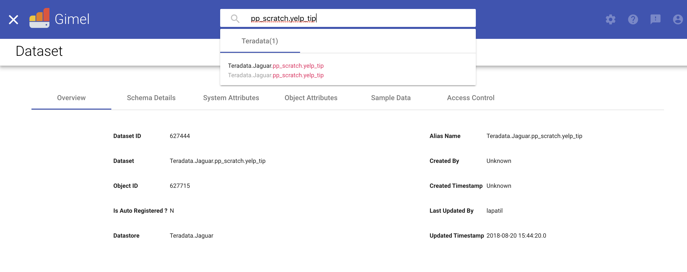

* [Gimel JDBC API](#gimel-jdbc-api)
   * [JDBC Read API](#jdbc-read-api)
      * [How to get the DataSet name](#how-to-get-the-dataset-name)
      * [JDBC Read Options](#teradata-read-options)
      * [READ from Teradata Table using Gimel API - BATCH Read (No FASTEXPORT)](#read-from-teradata-table-using-gimel-api---batch-read-no-fastexport)
      * [READ from Teradata Table using Gimel API with FASTEXPORT](#read-from-teradata-table-using-gimel-api-with-fastexport)
      * [READ from Teradata Table using Gimel API with Password File](#read-from-teradata-table-using-gimel-api-with-password-file) 

  
  * [JDBC Write API](#jdbc-write-api)
     * [How to get the DataSet name](#how-to-get-the-dataset-name-1)
     * [JDBC Write Options](#options-for-write-api)
     * [Write into Teradata Table using Gimel API- BATCH Write (No FASTLOAD)](#write-into-teradata-table-using-gimel-api--batch-write-no-fastload)
     * [Write into Teradata Table using Gimel API with FASTLOAD](#write-into-teradata-table-using-gimel-api-with-fastload)
     * [Write into Teradata Table using Gimel API- BATCH Write -No FASTLOAD- with Password File](#write-into-teradata-table-using-gimel-api--batch-write--no-fastload--with-password-file)
     * [JDBC Update API](#teradata-update-api)
  * [JDBC QueryPushdown](#jdbc-querypushdown)    
      * [Gimel ExecuteBatch with QueryPushDown](#gimel-executebatch-with-querypushdown---with-gimelproxyuser)
      * [Teradata-To-Any-Storage | JDBC Query PushDown](#teradata-to-any-storage--jdbc-query-pushdown)
  
  * [Create API](#create-api)
  * [Drop API](#drop-api)
  * [Truncate API](#truncate-api)
  
---------------------------------------------------------------------------------------------------------------------
  
  * [Teradata Benchmarking](teradata-docs/teradata-benchmarking/README.md)

--------------------------------------------------------------------------------------------------------------------


## Note

* This is an experimental API.
* NOT vetted yet to be used at scale in production.
* Please contact Gimel Team if you consider using this API for your usecases.

--------------------------------------------------------------------------------------------------------------------

# Gimel JDBC API


## JDBC Read API
Gimel JDBC APIs can be used to read data from Teradata. [See how Teradata READ API works.](teradata-docs/teradata-read-explained.md)

There are two ways you can read data from Teradata.
1. [Using Dataset.Read()](#read-from-teradata-table-using-gimel-api---batch-read-no-fastexport)
2. [Using ExecuteBatch SQL](#jdbc-querypushdown)

Both of the above ways make use of Dataset which is a logical abstraction over actual table in Teradata.

#### How to get the DataSet name?
1. Using UDC. 

   Go to UDC and search for the required table and get the dataset name.
   

2. Using External Hive Table
   Example:

    ###### Teradata table
       
        CREATE TABLE PP_SCRATCH.YELP_TIP 
        (
        text varchar(500),
        date varchar(500),
        likes varchar(500),
        business_id varchar(500),
        user_id varchar(500)
        )
     

    ###### Create Hive Table Pointing to Teradata table

       
        // no need of schema here
        CREATE external TABLE PCATALOG.YELP_TIP_HIVE(
        temp string  
        )
        TBLPROPERTIES (
        'gimel.storage.type'='JDBC',
        'gimel.jdbc.driver.class'='com.teradata.jdbc.TeraDriver',
        'gimel.jdbc.input.table.name'=' PP_SCRATCH.YELP_TIP',
        'gimel.jdbc.url'='jdbc:teradata://jaguar2.vip.paypal.com'
        );
      
    
      
    

#### Options for READ API
Teradata Read API supports read from table in two ways:
* Batch Read
* FASTEXPORT Read


#### JDBC Read Options
* **gimel.jdbc.username** :(optional) Username of the Teradata user

* **gimel.jdbc.p.strategy**: (optional) Password strategy defines, whether you want to user Gimel's proxy user or password file as strategy.

* **gimel.jdbc.p.file**: (optional)  password file PATH, if using **gimel.jdbc.p.strategy** is set as **file** 

* **charset**:(optional)  Character set or encoding of the text.

* **partitionColumn**: The column to be specified as a partitionColumn in order to parallelize the read operation. User can specify it mannually or default partitionColumn will be the Primary Index of the table. 

   NOTE: partitionColumn must be a **numeric** column from the table in question

* **lowerBound** :  This specifies lower bound of partition column. If not specified, the lowerBounnd will be the minimum value in partitionColumn

* **upperBound** :  This specifies upper bound of partition column. If not specified, the upperBound will be the minimum value in partitionColumn

* **numPartitions**: The maximum number of partitions that can be used for parallelism in table reading and writing. This also determines the maximum number of concurrent JDBC connections. If the number of partitions to write exceeds this limit, we decrease it to this limit by calling coalesce(numPartitions) before writing.

* **fetchSize**: The JDBC fetch size, which determines how many rows to fetch per round trip. This can help performance on JDBC drivers which default to low fetch size to 10000. This option applies only to reading.

* **gimel.jdbc.read.type**: This option specifies whether User wants to use batch read without FASTEXPORT or read with FASTEXPORT. Deafult values is set to empty string.

* **SESSIONS** : This specifoes numbe rof sessions to use for Teradata Read operation.


Options with default values:

|    Option     | Default       | Values to specify |
| ------------- | ------------- |-----------------|
| gimel.jdbc.username | spark.user | Username |
| gimel.jdbc.p.file  | hdfs:///user/$USER/password/teradata/pass.dat  | An HDFS file path containing password |
| charset | UTF16 | ASCII,UTF8,UTF16 |
|numPartitions|16| Required  number of partitions |
|partitionColumn|Primary index for the table else no column | The column on which the data to be partitioned|
|lowerBound|min value of primary index column else none| Lower bound of the values in partition column, if known |
|upperBound|max value of primary index column else none | Upper bound of the values in partition column, if known |
|fetchSize| 10000 | User specified fetchSize |
|gimel.jdbc.p.strategy| - | "file" , if gimel.jdbc.p.strategy specified as file, set gimel.jdbc.p.file as well|
| gimel.jdbc.read.type  | - | FASTEXPORT |
|SESSIONS|5| Required  number of sessions|


### READ from Teradata Table using Gimel API - BATCH Read (No FASTEXPORT)

```scala
// common imports
import org.apache.spark._
import org.apache.spark.sql._
import com.paypal.gimel.DataSet

//Initiate DataSet
val dataSet: DataSet = DataSet(sparkSession)

//options "can" be used to specify extra parameters to read data from teradata
val partitions = 4
val fetchSize = 10000

val options = Map(
          ("numPartitions", s"${partitions}")
        , ("fetchSize", s"${fetchSize}")
)

//read API
val readdf = dataSet.read(s"Teradata.Jaguar.PP_SCRATCH.YELP_TIP", options)

// Do some usecase
readdf.show()
```

### READ from Teradata Table using Gimel API with FASTEXPORT
```scala
// common imports
import org.apache.spark._
import org.apache.spark.sql._
import com.paypal.gimel.DataSet

//Initiate DataSet
val dataSet: DataSet = DataSet(sparkSession)

//options "can" be used to specify extra parameters to read data from teradata
val partitions = 4
val fetchSize = 10000

val options = Map(
          ("numPartitions", s"${partitions}")
        , ("fetchSize", s"${fetchSize}")
        , ("gimel.jdbc.read.type", "FASTEXPORT")
)

val readdf = dataSet.read(s"Teradata.Jaguar.PP_SCRATCH.YELP_TIP", options)


// Do some usecase
readdf.show()
```

### READ from Teradata Table using Gimel API with Password File

#### Setting password for JDBC datasource
* Using Proxy User

This way will mask the spark user with Gimel's proxy user. User will not need to specify password in this case.

* Using Password File

Password for JDBC data sources are specified in the file stored in any HDFS location. If not specified, default the API will look for password file at location in HDFS ```hdfs:///user/$USER/password/teradata/pass.dat``` . 
This file will contain password in the format ```jdbc_url/$USER,password``` .

e.g. The password for Teradata can be specified in file  ```hdfs:///user/$USER/password/teradata/pass.dat```  as:

```jaguar2.vip.paypal.com/$USER,PASSWORD```

Password for JDBC data source can be specified as agruments in the APIs in two ways:
1. Spark Configuration parameters:

    Use ```--conf gimel.jdbc.p.file=PASSWORD_FILE_PATH_IN_HDFS```
2. As options in READ/WRITE APIs:

    ```val options= Map(("gimel.jdbc.p.file", "hdfs:///user/lapatil/password/teradata/pass.dat"))```

* API Usuage:

```scala
// common imports
import org.apache.spark._
import org.apache.spark.sql._
import com.paypal.gimel.DataSet

//Initiate DataSet
val dataSet: DataSet = DataSet(sparkSession)

val partitions = 4
val fetchSize = 10000

val options = Map(
          ("numPartitions", s"${partitions}")
        , ("fetchSize", s"${fetchSize}")
        , ("gimel.jdbc.read.type", "FASTEXPORT")
        ,("gimel.jdbc.p.strategy","file")
        ,("gimel.jdbc.p.file","/user/lapatil/pass.dat")
)

val readdf = dataSet.read(s"Teradata.Jaguar.PP_SCRATCH.YELP_TIP", options)

// Do some usecase
readdf.show()
```

## JDBC Write API

Gimel JDBC APIs can be used to write into Teradata table. [See how Teradata WRITE API works](teradata-docs/teradata-write-explained.md)

There are two ways you can read data from Teradata.
1. [Using Dataset.write()](#teradata-write-with-gimelproxyuser)
2. Using [ExecuteBatch SQL](#jdbc-querypushdown)

Both of the above ways make use of Dataset which is a logical abstraction over actual table in Teradata.

#### How to get the DataSet name?
1. Using UDC

   Go to UDC and search for the required table and get the dataset name.
   

2. Using External Hive Table
   Example:

    ###### Teradata table
       
        CREATE TABLE PP_SCRATCH.YELP_TIP 
        (
        text varchar(500),
        date varchar(500),
        likes varchar(500),
        business_id varchar(500),
        user_id varchar(500)
        )
     

    ###### Create Hive Table Pointing to Teradata table

       
        // no need of schema here
        CREATE external TABLE PCATALOG.YELP_TIP_HIVE(
        temp string  
        )
        TBLPROPERTIES (
        'gimel.storage.type'='JDBC',
        'gimel.jdbc.driver.class'='com.teradata.jdbc.TeraDriver',
        'gimel.jdbc.input.table.name'=' PP_SCRATCH.YELP_TIP',
        'gimel.jdbc.url'='jdbc:teradata://jaguar2.vip.paypal.com'
        );
      
    


 

#### Options for WRITE API
Teradata Write API supports read from table in two ways:
* Batch Write
* FASTLOAD Write


##### Teradata Read Options
* **gimel.jdbc.username** :(optional) Username of the Teradata user

* **gimel.jdbc.p.strategy**: (optional) Password strategy defines, whether you want to user Gimel's proxy user or password file as strategy.

* **gimel.jdbc.p.file**: (optional)  password file PATH, if using **gimel.jdbc.p.strategy** is set as **file** 

* **gimel.jdbc.insertStrategy**: This option specifies how you want to write data into Teradata.<br />
                                1. insert (default): Just insert into Teradata table. <br />
                                2. FullLoad: Trusncate table and insert into table. <br />
                                3. update: Update table with Primary key. <br />
                                4. append: Update and Insert. <br />

* **charset**:(optional)  Character set or encoding of the text.

* **numPartitions**: The maximum number of partitions that can be used for parallelism in table reading and writing. This also determines the maximum number of concurrent JDBC connections. If the number of partitions to write exceeds this limit, we decrease it to this limit by calling coalesce(numPartitions) before writing.

* **batchSize**: The JDBC batch size, which determines how many rows to insert per round trip. This can help performance on JDBC drivers. This option applies only to writing. It defaults to 10000.

* **gimel.jdbc.write.type**: This option specifies whether User wants to use write without FASTLOAD or with FASTLOAD. Deafult values is set to empty string.

* **SESSIONS** : This specifies numbe rof sessions to use for Teradata Write operation.


Options with default values:

|    Option     | Default       | Values to specify |
| ------------- | ------------- |-----------------|
| gimel.jdbc.username | spark.user | Username |
| gimel.jdbc.p.file  | hdfs:///user/$USER/password/teradata/pass.dat  | An HDFS file path containing password |
|gimel.jdbc.insertStrategy| insert | insert, FullLoad, upsert, update |
| charset | UTF16 | ASCII,UTF8,UTF16 |
|numPartitions|12| Required  number of partitions |
|batchSize| 10000 | User specified batchSize |
|gimel.jdbc.p.strategy| - | "file" , if gimel.jdbc.p.strategy specified as file, set gimel.jdbc.p.file as well|
| gimel.jdbc.write.type  | - | FASTLOAD |
|SESSIONS|5| Required  number of sessions|

### Create Teradata table
```sql
create table pp_scratch.user_test
(
    id bigint,
    "name" varchar(300),
    rev bigint
);
```

### Create Hive Table Pointing to Teradata table

```sql
create external table pcatalog.user_test
(
    id bigint,
    name string,
    rev bigint
)
TBLPROPERTIES (
    'gimel.storage.type'='JDBC',
    'gimel.jdbc.driver.class'='com.teradata.jdbc.TeraDriver',
    'gimel.jdbc.input.table.name'='pp_scratch.user_test',
    'gimel.jdbc.url'='jdbc:teradata://jaguar2.vip.paypal.com'
)
```
### Teradata Write with GimelProxyUser
### Write into Teradata Table using Gimel API- BATCH Write (No FASTLOAD)
```scala
//Initiate DataSet
val dataset = com.paypal.gimel.DataSet(sparkSession)

val batchSize = 1000
val partitions = 2

val options: Map[String, String] = Map(
        ("batchSize", s"${batchSize}")
        , ("numPartitions", s"${partitions}")
         )

dataSet.write(s"Teradata.Jaguar.PP_SCRATCH.YELP_TIP", readdf, options)
         
```

### Write into Teradata Table using Gimel API with FASTLOAD
```scala
//Initiate DataSet
val dataset = com.paypal.gimel.DataSet(sparkSession)

val batchSize = 1000
val partitions = 2

val options: Map[String, String] = Map(
        ("batchSize", s"${batchSize}")
        , ("numPartitions", s"${partitions}"),
        , ("gimel.jdbc.read.type", "FASTLOAD")
         )

dataSet.write(s"Teradata.Jaguar.PP_SCRATCH.YELP_TIP", readdf, options)
         
```

### Write into Teradata Table using Gimel API- BATCH Write -No FASTLOAD- with Password File


#### Setting password for JDBC datasource
* Using Proxy User

This way will mask the spark user with Gimel's proxy user. User will not need to specify password in this case.

* Using Password File

Password for JDBC data sources are specified in the file stored in any HDFS location. If not specified, default the API will look for password file at location in HDFS ```hdfs:///user/$USER/password/teradata/pass.dat``` . 
This file will contain password in the format ```jdbc_url/$USER,password``` .

e.g. The password for Teradata can be specified in file  ```hdfs:///user/$USER/password/teradata/pass.dat```  as:

```jaguar2.vip.paypal.com/$USER,PASSWORD```

Password for JDBC data source can be specified as agruments in the APIs in two ways:
1. Spark Configuration parameters:

    Use ```--conf gimel.jdbc.p.file=PASSWORD_FILE_PATH_IN_HDFS```
2. As options in READ/WRITE APIs:

    ```val options= Map(("gimel.jdbc.p.file", "hdfs:///user/lapatil/password/teradata/pass.dat"))```
   

* API Usuage:

```scala
//Initiate DataSet
val dataset = com.paypal.gimel.DataSet(sparkSession)

val batchSize = 1000
val partitions = 2

val options: Map[String, String] = Map(
        ("batchSize", s"${batchSize}")
        , ("numPartitions", s"${partitions}")
        ,("gimel.jdbc.p.strategy","file")
        ,("gimel.jdbc.p.file","/user/lapatil/pass.dat")
         )
dataSet.write(s"Teradata.Jaguar.PP_SCRATCH.YELP_TIP", readdf, options)

```

### Teradata Update API

Teradata Update API works using write API. All JDBC options for the write are supported in update API as well. Teradata update API adds one more option to update the table: jdbc.insertStrategy

_Requirement_: User should specify **gimel.jdbc.update.whereColumns** for UPDATE and UPSERT operations. If not specified, API will use PRIMARY keys of table as where conditions. 

**_Limitation_**: This Update API constructs following kind of query:
```sql
UPDATE TARGET_TABLE
SET COLUMN1 = VALUE
WHERE
    COLUMN2 = VALUE
AND COLUMN3 = VALUE
```
Currently, update API does is limited to where conditions in equality(=) and **_DOES NOT_** support inequality conditions (**>,<,>=,<=**) etc.


|    Option     | Default       | Values to specify |
| ------------- | ------------- |-----------------|
| gimel.jdbc.insertStrategy | insert | update,FullLoad,upsert |


#### Teradata Update table [Update] : ```gimel.jdbc.insertStrategy=update```
Gimel Teradata write API updates the table based on primary keys in the table.
 Setting this option, API updates the teradata table where primary key matches the corresponding column in given dataframe.

|    Option     | Default       | Values to specify |
| ------------- | ------------- |-----------------|
| gimel.jdbc.insertStrategy | - | update|
|gimel.jdbc.update.setColumns | all columns of the table | column1,column2 |
|gimel.jdbc.update.whereColumns | primary keys of the table | column1,column2 |


```scala
// set the update option: gimel.jdbc.insertStrategy=update

//Initiate DataSet
val dataset = com.paypal.gimel.DataSet(sparkSession)

val batchSize = 1000
val partitions = 2

val options: Map[String, String] = Map(
         ("gimel.jdbc.insertStrategy", "update")
        , ("batchSize", s"${batchSize}")
        , ("numPartitions", s"${partitions}")
        , ("gimel.jdbc.update.setColumns","text,date")
        , ("gimel.jdbc.update.whereColumns","business_id")
         )
dataSet.write(s"Teradata.Jaguar.PP_SCRATCH.YELP_TIP", readdf, options)

```

#### Teradata Update table [Truncate-Insert] : ```gimel.jdbc.insertStrategy=FullLoad```
Gimel Teradata write API updates the table based on primary keys in the table.
Setting this option, API truncates the teradata target table first & then inserts the source dataframe into target table.

_NOTE_: No need to specify **gimel.jdbc.update.setColumns** and **gimel.jdbc.update.whereColumns** properties in this case.

|    Option     | Default       | Values to specify |
| ------------- | ------------- |-----------------|
| gimel.jdbc.insertStrategy | - | FullLoad|

```scala
// set the update option: jdbc.insertStrategy=FullLoad

//Initiate DataSet
val dataset = com.paypal.gimel.DataSet(sparkSession)

val batchSize = 1000
val partitions = 2

val options: Map[String, String] = Map(
         ("gimel.jdbc.insertStrategy", "FullLoad")
        , ("batchSize", s"${batchSize}")
        , ("numPartitions", s"${partitions}")
         )
dataSet.write(s"Teradata.Jaguar.PP_SCRATCH.YELP_TIP", readdf, options)

```


#### Teradata Update table [Update-Insert] : ```jdbc.insertStrategy=upsert```
Gimel Teradata write API updates the table based on primary keys in the table.
Setting this option, API updates the target teradata table wherever primary key of target table matches corresponding column value in source dataframe. If key is not found in target table, it inserts the corresponding row into target teradata table.

|    Option     | Default       | Values to specify |
| ------------- | ------------- |-----------------|
| gimel.jdbc.insertStrategy | - | upsert|
|gimel.jdbc.update.setColumns | all columns of the table | column1,column2 |
|gimel.jdbc.update.whereColumns | primary keys of the table | column1,column2 |

```scala

//Initiate DataSet
val dataset = com.paypal.gimel.DataSet(sparkSession)

val batchSize = 1000
val partitions = 2

val options: Map[String, String] = Map(
         ("gimel.jdbc.insertStrategy", "upsert")
        , ("batchSize", s"${batchSize}")
        , ("numPartitions", s"${partitions}")
        , ("gimel.jdbc.update.setColumns","text,date")
        , ("gimel.jdbc.update.whereColumns","business_id")
         )
dataSet.write(s"Teradata.Jaguar.PP_SCRATCH.YELP_TIP", readdf, options)

```


-------------------------------------------------------------------------------------------------------------------
## JDBC QueryPushdown

[See how Gimel QueryPushDown works.](teradata-docs/JDBC-Query-Pushdown-explained.md)

### Gimel ExecuteBatch with QueryPushDown - with GimelProxyUser

```scala
val partitions = 4
val fetchSize = 10000

spark.sql("set gimel.catalog.provider=PCATALOG")
spark.sql(s"SET numPartitions=${partitions}")
spark.sql(s"SET fetchSize=${fetchSize}")
spark.sql(s"SET gimel.jdbc.read.type=FASTEXPORT")
spark.sql(s"SET gimel.jdbc.enableQueryPushdown=true")


val sql = s""" SELECT count(*) as cnt 
                FROM 
                pcatalog.Teradata.Jaguar.pp_scratch.GIMEL_FACT_PMT_2_WRITE_10000M a
                INNER JOIN 
                pcatalog.Teradata.Jaguar.pp_scratch.GIMEL_FACT_PMT_2_WRITE_10000M b
                  ON a.id > b.id
            """
val df = GimelQueryProcessor.executeBatch(sql, sparkSession)

```
### Teradata-To-Any-Storage | JDBC Query PushDown

_ENTIRE TERADATA QUERY WILL BE PUSHED TO TD SERVER, ONLY RESULTS WILL BE RETURNED TO SPARK APP_

#### Sample Steps
```scala
// import
import com.paypal.gimel.scaas.GimelQueryProcessor

// Credentials
spark.sql("set gimel.catalog.provider=PCATALOG")
spark.sql(s"SET numPartitions=4")
spark.sql(s"SET fetchSize=10000")
spark.sql(s"SET gimel.jdbc.read.type=FASTEXPORT")
spark.sql(s"SET gimel.jdbc.enableQueryPushdown=true")

// Set this function if your entire select clause is on just one Teradata System, say Simba

// Execute your Query - Entire Query
 com.paypal.gimel.scaas.GimeQueryProcessor.executeBatch(
   """
   |insert into PCATALOG.Horton.Hive.default.Gimel_Testing_Hive_Table
   | select * from
   | (
   | select
   | distinct(dim_cust.cust_id) as cust_id
   | , sum(txn.pmt_usd_amt) over (partition by dim_cust.cust_id) as total_tnx_amt
   |  , count(txn.pmt_txnid) over (partition by cust_id) as total_txn_count
   |  from
   |  pcatalog.simba_pp_engineering_views_dim_cust dim_cust
   |  join pcatalog.simba_pp_engineering_views_fact_pmt txn
   |  on dim_cust.cust_id = txn.sndr_id
   |  where txn.pmt_cre_dt  >= current_date-2
   | ) tbl
   | where tbl.total_txn_count > 5000
   |""".stripMargin ,
   sparkSession);
   
```

--------------------------------------------------------------------------------------------------------------------


## Create API
// We need to pass the schema and system attributes in the json

```scala
val dataSetProps = s"""
{"datasetType":"JDBC","fields":[{"fieldName":"id","fieldType":"VARCHAR(10)","isFieldNullable": false},{"fieldName":"name","fieldType":"VARCHAR(10)","isFieldNullable": false}],"partitionFields":[],"props":{"gimel.jdbc.input.table.name":"pp_scratch.yelp_tip_td13","gimel.storage.type":"JDBC","gimel.jdbc.url":"jdbc:teradata://jackal.vip.paypal.com","gimel.jdbc.driver.class":"com.teradata.jdbc.TeraDriver"}}"""
val options = Map(("gimel.catalog.provider","USER"),("pcatalog.teradata.jackal.pp_scratch.yelp_tip13.dataSetProperties",dataSetProps),("gimel.jdbc.username","balan"),("gimel.jdbc.p.file","hdfs://tahore123/user/bagopalan/pass.dat"));
spark.conf.set("gimel.catalog.provider","USER")
val isCreated = dataSet.create("pcatalog.teradata.jackalrocks.pp_skate.yelp_tip13", options)
```

--------------------------------------------------------------------------------------------------------------------

* Create table in teradata database
```scala
// We need to pass the schema and a flag getSystemProp to true so that the application will retrive the system attributes

val dataSetProps = s"""{"datasetType":"JDBC","fields":[{"fieldName":"id","fieldType":"VARCHAR(10)","isFieldNullable": false},{"fieldName":"name","fieldType":"VARCHAR(10)","isFieldNullable": false}],"partitionFields":[],"props":{"gimel.jdbc.input.table.name":"pp_scratch.yelp_tip19","gimel.get.system.properties":"true"}}"""
val options2 = Map(("gimel.catalog.provider","USER"),("pcatalog.teradata.jackal.pp_scratch.yelp_tip19.dataSetProperties",dataSetProps),("gimel.jdbc.username","balan"),("gimel.jdbc.p.file","hdfs://thaore123/user/bagopalan/pass.dat"));
spark.conf.set("gimel.catalog.provider","USER")
val isCreated = dataSet.create("pcatalog.teradata.jackalhourse.pp_kate.yelp_tip19", options2 )
```

--------------------------------------------------------------------------------------------------------------------

## Drop API
```scala
val options = Map(("gimel.catalog.provider","PCATALOG"),("gimel.jdbc.username","bagopalan"),("gimel.jdbc.p.file","hdfs://tahore123/user/bagopalan/pass.dat"));
spark.conf.set("gimel.catalog.provider","PCATALOG")
val isCreated = dataSet.drop("pcatalog.teradata.jackalrocks.pp_skate.yelp_tip13", options)
```

--------------------------------------------------------------------------------------------------------------------

## Truncate API
* Truncates the table (purge the data from the table)
```scala
val options = Map(("gimel.catalog.provider","PCATALOG"),("gimel.jdbc.username","balan"),("gimel.jdbc.p.file","hdfs://tahore123/user/bagopalan/pass.dat"));
spark.conf.set("gimel.catalog.provider","PCATALOG")
val isCreated = dataSet.truncate("pcatalog.teradata.jackalhorse.pp_sskate.yelp_tip14", options))
```

--------------------------------------------------------------------------------------------------------------------

