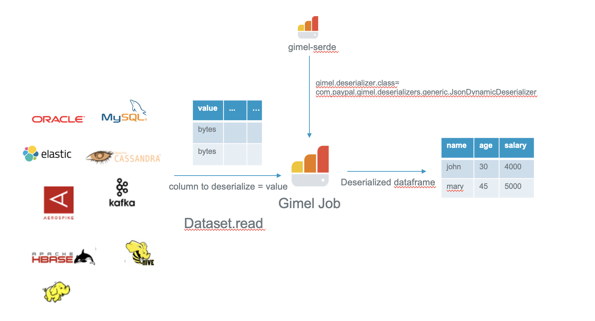
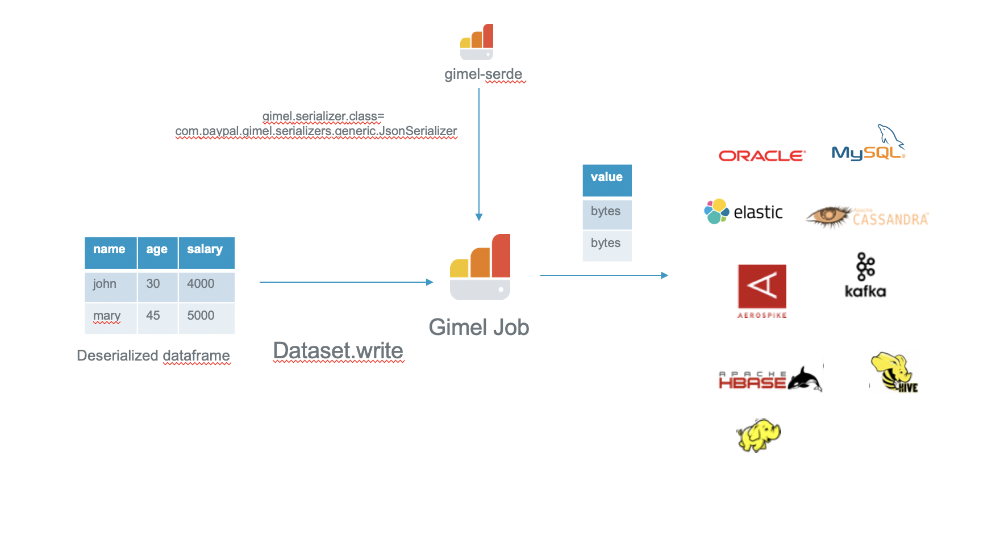

# Gimel Serde (Serializer/Deserializer)

- Gimel Serde provides pluggable Serializer/Deserializer classes which can be loaded at runtime while reading/writing data using Gimel Data API or Gimel SQL. 
- Deserializers are used to convert the raw bytes into a format like avro/string/json


<br><br>
- Serializers are used to convert deserialized messages to bytes.


<br><br>
Currently, gimel-serde module provides the following deserializers and serializers:

  * [Generic Deserializers](#generic-deserializers)
    * [Avro](#avro-deserializer)
    * [String](#string-deserializer)
    * [Json Dynamic](#json-dynamic-deserializer)
    * [Json Static](#json-static-deserializer)
    
 * [Generic Serializers](#)
     * [Avro](#avro-serializer)
     * [String](#string-serializer)
     * [Json](#json-serializer)  
  
Users can create their own Serializer/Deserializer classes and plug it with Gimel Data API at runtime by following steps:
 * Add serde-common dependency in your project
 
 ```xml
  <dependency>
    <groupId>com.paypal.gimel</groupId>
    <artifactId>serde-common</artifactId>
    <version>1.0-SNAPSHOT</version>
   </dependency>
 ```

* Implement Deserializer/Serializer interface
* Add your logic to the method 

```scala
def deserialize(dataFrame: DataFrame, props: Map[String, Any] = Map.empty) : DataFrame
```

Or 

```scala
def serialize(dataFrame: DataFrame, props: Map[String, Any] = Map.empty) : DataFrame
```

--------------------------------------------------------------------------------------------------------------------

For using gimel serde, you need to include the following jars in your spark session:
* Gimel Jars
* Deserializer jar

Example: 
```shell script
spark-shell --jars \
generic-deserializers-1.0-SNAPSHOT-uber.jar,\
generic-serializers-1.0-SNAPSHOT-uber.jar,\
gimel-tools-2.0.0-SNAPSHOT-uber.jar
```

## Generic Deserializers

### Avro Deserializer

#### Schema Source = CSR (Confluent Schema Registry)

* Avro Schema String would be fetched from Confluent Schema Registry
* Set gimel.deserializer.avro.schema.source=CSR

```scala
val dataset = com.paypal.gimel.DataSet(spark)
  
val options = Map("rest.service.method" -> "https",
"rest.service.host" -> "udc-rest-service-host",
"rest.service.port" -> "443",
"gimel.deserializer.avro.schema.url" -> "http://schema-registry-host:8081",
"gimel.deserializer.avro.schema.source" -> "CSR",
"gimel.deserializer.avro.schema.subject" -> "test_subject",
"gimel.deserializer.class" -> "com.paypal.gimel.deserializers.generic.AvroDeserializer")

val df = dataset.read("udc.Kafka.Gimel_Dev.default.test_avro_csr", options)
df.show
```

#### Schema Source = INLINE

* Avro Schema String has to be provided by setting "gimel.deserializer.avro.schema.string" option
* Set gimel.deserializer.avro.schema.source=INLINE

```scala
val empAvroSchema =
    s"""{"namespace": "namespace",
          "type": "record",
          "name": "test_emp",
          "fields": [
              {\"name\": \"address\", \"type\": \"string\"},
              {\"name\": \"age\", \"type\": \"string\"},
              {\"name\": \"company\", \"type\": \"string\"},
              {\"name\": \"designation\", \"type\": \"string\"},
              {\"name\": \"id\", \"type\": \"string\"},
              {\"name\": \"name\", \"type\": \"string\"},
              {\"name\": \"salary\", \"type\": \"string\"}
         ]}""".stripMargin

val dataset = com.paypal.gimel.DataSet(spark)
  
val options = Map("rest.service.method" -> "https",
"rest.service.host" -> "udc-rest-service-host",
"rest.service.port" -> "443",
"gimel.deserializer.avro.schema.source" -> "INLINE",
"gimel.deserializer.avro.schema.string" -> empAvroSchema,
"gimel.deserializer.class" -> "com.paypal.gimel.deserializers.generic.AvroDeserializer")

val df = dataset.read("udc.Kafka.Gimel_Dev.default.test_avro_inline", options)
df.show
```

### String Deserializer

```scala
val dataset = com.paypal.gimel.DataSet(spark)
  
val options = Map("rest.service.method" -> "https",
"rest.service.host" -> "udc-rest-service-host",
"rest.service.port" -> "443",
"gimel.deserializer.class" -> "com.paypal.gimel.deserializers.generic.StringDeserializer")

val df = dataset.read("udc.Kafka.Gimel_Dev.default.test_string", options)
df.show
```

### Json Dynamic Deserializer

- This Deserializer automatically detects the schema from json and returns a dataframe.
- It does not work with structured streaming API as it requires the schema to be specified at runtime.
- Please use JsonStaticDeserializer for structured streaming.

```scala
val dataset = com.paypal.gimel.DataSet(spark)
  
val options = Map("rest.service.method" -> "https",
"rest.service.host" -> "udc-rest-service-host",
"rest.service.port" -> "443",
"gimel.deserializer.class" -> "com.paypal.gimel.deserializers.generic.JsonDynamicDeserializer")

val df = dataset.read("udc.Kafka.Gimel_Dev.default.test_json_dynamic", options)
df.show
```

### Json Static Deserializer

It is mainly used for structured streaming as it requires schema for the json at runtime.

#### Structured Streaming

```scala
import com.paypal.gimel._

val dataStream = DataStream2(spark)

// Specify schema for the json
val fieldsBindToString=s"""[{"fieldName":"name","fieldType":"string","defaultValue":"null"},{"fieldName":"age","fieldType":"string","defaultValue":"null"}, {"fieldName":"address","fieldType":"string","defaultValue":""} ]"""
val options=Map("rest.service.method" -> "https",
"rest.service.host" -> "udc-rest-service-host",
"rest.service.port" -> "443",
"gimel.deserializer.class" -> "com.paypal.gimel.deserializers.generic.JsonStaticDeserializer",
"gimel.fields.bind.to.json" -> fieldsBindToString)
val streamingResult = dataStream.read("udc.Kafka.Gimel_Dev.default.test_json_static", options)

val df = streamingResult.df
df.isStreaming
val writer = df.writeStream.outputMode("append").format("console").start
```

## Generic Serializers

### Avro Serializer

#### Schema Source = INLINE

* Avro Schema String has to be provided by setting "gimel.serializer.avro.schema.string" option
* Set gimel.serializer.avro.schema.source=INLINE

The use case below includes following steps:

1. Consume messages from kafka topic having json messages and deserialize them with JsonDynamicDeserializer.
2. Serialize the consumed messages into avro format using AvroSerializer and publish to another kafka topic.
3. Deserialize the messages in avro topic using Avro Deserializer for verification.

```scala
val dataset = com.paypal.gimel.DataSet(spark)

val empAvroSchema =
    s"""{"namespace": "namespace",
          "type": "record",
          "name": "test_emp",
          "fields": [
              {\"name\": \"address\", \"type\": \"string\"},
              {\"name\": \"age\", \"type\": \"string\"},
              {\"name\": \"company\", \"type\": \"string\"},
              {\"name\": \"designation\", \"type\": \"string\"},
              {\"name\": \"id\", \"type\": \"string\"},
              {\"name\": \"name\", \"type\": \"string\"},
              {\"name\": \"salary\", \"type\": \"string\"}
         ]}""".stripMargin

val options = Map("rest.service.method" -> "https",
"rest.service.host" -> "udc-rest-service-host",
"rest.service.port" -> "443",
"gimel.serializer.avro.schema.source" -> "INLINE",
"gimel.serializer.class" -> "com.paypal.gimel.serializers.generic.AvroSerializer",
"gimel.serializer.avro.schema.string" -> empAvroSchema,
"gimel.deserializer.class" -> "com.paypal.gimel.deserializers.generic.JsonDynamicDeserializer")

// Deserializes the json messages using JsonDynamicDeserializer
val df = dataset.read("udc.Kafka.Gimel_Dev.default.test_json", options)
df.cache.show

// Do any processing if required on the source dataframe

// Serializes the messages to avro format using 
// gimel.serializer.class=com.paypal.gimel.serializers.generic.AvroSerializer
dataset.write("udc.Kafka.Gimel_Dev.default.test_avro", df, options)

val options = Map("rest.service.method" -> "https",
"rest.service.host" -> "udc-rest-service-host",
"rest.service.port" -> "443",
"gimel.deserializer.avro.schema.source" -> "INLINE",
"gimel.deserializer.avro.schema.string" -> empAvroSchema,
"gimel.deserializer.class" -> "com.paypal.gimel.deserializers.generic.AvroDeserializer")

// Verify the messages in udc.Kafka.Gimel_Dev.default.test_avro topic by deserializing the avro messages 
// using gimel.deserializer.class=com.paypal.gimel.deserializers.generic.AvroDeserializer
val df = dataset.read("udc.Kafka.Gimel_Dev.default.test_avro", options)
df.show
```

#### Schema Source = CSR (Confluent Schema Registry)

* Avro Schema String would be fetched from Confluent Schema Registry
* Set gimel.serializer.avro.schema.source=CSR

The use case above can also be run with avro schema in Schema Registry.
```scala
val dataset = com.paypal.gimel.DataSet(spark)

val options = Map("rest.service.method" -> "https",
"rest.service.host" -> "udc-rest-service-host",
"rest.service.port" -> "443",
"gimel.serializer.avro.schema.url" -> "http://schema-registry-host:8081",
"gimel.serializer.avro.schema.source" -> "CSR",
"gimel.serializer.class" -> "com.paypal.gimel.serializers.generic.AvroSerializer",
"gimel.serializer.avro.schema.subject" -> "test_emp",
"gimel.deserializer.class" -> "com.paypal.gimel.deserializers.generic.JsonDynamicDeserializer")

// Deserializes the json messages using JsonDynamicDeserializer
val df = dataset.read("udc.Kafka.Gimel_Dev.default.test_json", options)
df.cache.show

// Do any processing if required on the source dataframe

// Serializes the messages to avro format using 
// gimel.serializer.class=com.paypal.gimel.serializers.generic.AvroSerializer
dataset.write("udc.Kafka.Gimel_Dev.default.test_avro", df, options)

val options = Map("rest.service.method" -> "https",
"rest.service.host" -> "udc-rest-service-host",
"rest.service.port" -> "443",
"gimel.deserializer.avro.schema.source" -> "CSR",
"gimel.deserializer.avro.schema.subject" -> "test_emp",
"gimel.deserializer.class" -> "com.paypal.gimel.deserializers.generic.AvroDeserializer")

// Verify the messages in udc.Kafka.Gimel_Dev.default.test_avro topic by deserializing the avro messages 
// using gimel.deserializer.class=com.paypal.gimel.deserializers.generic.AvroDeserializer
val df = dataset.read("udc.Kafka.Gimel_Dev.default.test_avro", options)
df.show
```

### String Serializer

```scala
val dataset = com.paypal.gimel.DataSet(spark)

val options = Map("rest.service.method" -> "https",
"rest.service.host" -> "udc-rest-service-host",
"rest.service.port" -> "443",
"gimel.serializer.class" -> "com.paypal.gimel.serializers.generic.StringSerializer",
"gimel.deserializer.class" -> "com.paypal.gimel.deserializers.generic.JsonDynamicDeserializer")

// Deserializes the json messages using JsonDynamicDeserializer
val df = dataset.read("udc.Kafka.Gimel_Dev.default.test_json", options)
df.cache.show

// Do any processing if required on the source dataframe

// Serializes the messages to avro format using 
// gimel.serializer.class=com.paypal.gimel.serializers.generic.StringSerializer
dataset.write("udc.Kafka.Gimel_Dev.default.test_string", df, options)

```

### Json Serializer

```scala
val dataset = com.paypal.gimel.DataSet(spark)

val options = Map("rest.service.method" -> "https",
"rest.service.host" -> "udc-rest-service-host",
"rest.service.port" -> "443",
"gimel.serializer.class" -> "com.paypal.gimel.serializers.generic.JsonSerializer",
"gimel.deserializer.class" -> "com.paypal.gimel.deserializers.generic.JsonDynamicDeserializer")

// Deserializes the json messages using JsonDynamicDeserializer
val df = dataset.read("udc.Kafka.Gimel_Dev.default.test_json_source", options)
df.cache.show

// Do any processing if required on the source dataframe

// Serializes the messages to avro format using 
// gimel.serializer.class=com.paypal.gimel.serializers.generic.JsonSerializer
dataset.write("udc.Kafka.Gimel_Dev.default.test_json_target", df, options)

```

