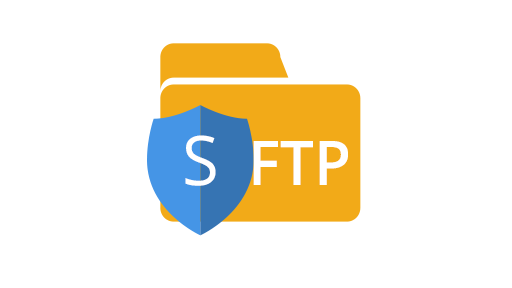

#  Gimel Data API

Gimel provides unified Data API to access data from any storage like HDFS, GS, Alluxio, Hbase, Aerospike, BigQuery, Druid, Elastic,  Teradata, Oracle, MySQL, SFTP, etc.

--------------------------------------------------------------------------------------------------------------------

Contents
=================

  * [Edit on GitHub](https://github.com/paypal/gimel)
  * [APIs & Version Compatibility](#stack-&-version-compatibility)
  * [Getting Started](getting-started/build-gimel.md)
  * [Gimel Catalog Providers](gimel-catalog/catalog-provider.md)
  * [Contribution Guidelines](CONTRIBUTING.md)
  * [Adding a new connector](gimel-connectors/adding-new-connector.md)
  * [Questions](#questions)

--------------------------------------------------------------------------------------------------------------------

# Stack & Version Compatibility

|    Compute/Storage/Language      | Version | Grade | Documentation | Notes |
| ------------- | ----------- | ------------ | ------------- |-----------------|
|  | 2.11.8 | PRODUCTION | |   Data API is built on scala 2.11.8   regardless the library should be compatible as long as the spark major version of library and the environment match   |
|  | 2.6.6 | PRODUCTION | [PySpark Support](getting-started/gimel-pyspark-support.md)  | Data API / GSQL works fully well with PySpark as long as spark version in environment & Gimel library matches. |
|  | 2.3.0 | | | This is the recommended version |
|  | 2.7.3 | | | This is the recommended version |
|  | 2.7.3 | PRODUCTION | [CSV Reader Doc](gimel-connectors/hdfs-csv.md) | CSV Reader & Writer for HDFS |
|  | 2.7.3 | PRODUCTION WITH LIMITATIONS | [Restful/Web-API Doc](gimel-connectors/restapi.md) |  Allows Accessing Data - to any source supporting - Rest API  |
|  | 2.7.3 | PRODUCTION WITH LIMITATIONS | [Cross-Cluster Doc](gimel-connectors/hdfs-crosscluster.md) |  Allows Accessing Data - Across Clusters - Allxio  |
|  | 0.10.2 | PRODUCTION | [Kafka Doc](gimel-connectors/kafka.md) | V0.10.2 is the PayPal's Supported Version of Kafka|
|   | 1.2 | PRODUCTION WITH LIMITATIONS | [HBASE Doc](gimel-connectors/hbase.md) | Leverages SHC Connector internally & also supports Batch/Get/Puts |
|  | 3.14 | EXPERIMENTAL | [Aerospike Doc](gimel-connectors/aerospike.md) | Experimental API for Aerospike reads / writes |
|  | 2.0 | EXPERIMENTAL | [Cassandra Doc](gimel-connectors/cassandra.md) |  Experimental API for Cassandra reads / writes Leverages DataStax Connector  |
|  | 5.6.4 | PRODUCTION | [ElasticSearch Doc](gimel-connectors/elasticsearch.md)| Has Special Support for PayPal's Daily ES indexes |
|  | 1.2 | PRODUCTION | [Hive Doc](gimel-connectors/hive.md) | |
|  | 1.6.2 | EXPERIMENTAL | [Teradata Doc](gimel-connectors/teradata.md) |  EXPERIMENTAL API Only Uses JDBC Connector internally  |
|  | 0.82 | PRODUCTION | [Druid Doc](gimel-connectors/druid.md) | Only Writes(Non-Batch Mode) |
|  | 0.82 | PRODUCTION | [SFTP Doc](gimel-connectors/sftp.md) | Read/Write files from/To SFTP server |
|   | 1.0 | PRODUCTION | [GSQL Doc](gimel-sql/gimel-sql.md) | Refer link for using GSQL (Gimel SQL) API |
|  Gimel Logging  | 0.4.3 | PRODUCTION | [Gimel Logging Doc](gimel-logging/gimel-logging.md) | This is the Gimel Logging Framework |
|  Gimel Serde  | 1.0 | PRODUCTION | [Gimel Serde Doc](gimel-serde/gimel-serde.md) | Pluggable gimel serializers and deserializers |
|  Unified Data Catalog  | 0.0.1 | PRODUCTION | [UDC Doc](udc/README.md) | This is Unified Data Catalog|

_________________________________________________________________________________________

# Questions

  * [Slack](https://gimel-dev.slack.com)
  * [User Forum](https://groups.google.com/d/forum/gimel-user)
  * [Developer Forum](https://groups.google.com/d/forum/gimel-dev)
