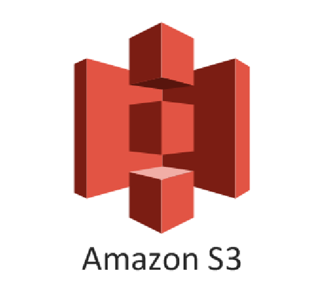

#  Gimel Data API

Contents
=================


| [What is gimel](#what-is-gimel) | [Gimel Overview](#gimel-overview)  | [APIs & Version Compatibility](#stack--version-compatibility) |
| ------------- | ----------- | ------------ | 


| [Getting Started](getting-started/build-gimel.md)  | [Gimel Catalog Providers](gimel-catalog/catalog-provider.md) | [Edit on GitHub](https://github.com/paypal/gimel)  |
| ------------- | ----------- | ------------ | 


| [Questions](#questions) | [Contribution Guidelines](CONTRIBUTING.md) | [Adding a new connector](gimel-connectors/adding-new-connector.md) |
| ------------- | ----------- | ------------ | 

--------------------------------------------------------------------------------------------------------------------

# What is gimel?

* Gimel is a Big Data Abstraction framework built on Apache Spark & other open source connectors in the industry.
* Gimel provides unified Data API to read & write data to various stores. 
* Alongside, a unified SQL access pattern for all stores alike. 
* The APIs are available in both scala & python (pyspark).

### Scala

```scala
/* Simple Data API example of read from kafka, transform & write to elastic */

// Initiate API
val dataset = com.paypal.gimel.DataSet(spark)

// Read Data | kafka semantics abstracted for user. 
// Refer "Gimel Catalog Providers" that abstracts dataset details
val df: DataFrame = dataset.read("kafka_dataset")

// Apply transformations (business logic | abstracted for Gimel)
val transformed_df: DataFrame = df(...transformations...)

// Write Data | Elastic semantics abstracted for user
dataset.write("elastic_dataset",df)

/* GSQL Reference */

// Create Gimel SQL reference
val gsql: (String) => DataFrame = com.paypal.gimel.sql.GimelQueryProcessor.executeBatch(_: String, spark)

// your SQL
val sql = """
insert into elastic_dataset
select * from kafka_dataset
"""

gsql(sql)

```

### Python | pyspark
```python

# import DataFrame and SparkSession
from pyspark.sql import DataFrame, SparkSession, SQLContext

# fetch reference to the class in JVM
ScalaDataSet = sc._jvm.com.paypal.gimel.DataSet

# fetch reference to java SparkSession
jspark = spark._jsparkSession

# initiate dataset
dataset = ScalaDataSet.apply(jspark)

# Read Data | kafka semantics abstracted for user
df = dataset.read("kafka_dataset")

# Apply transformations (business logic | abstracted for Gimel)
transformed_df = df(...transformations...)

# Write Data | Elastic semantics abstracted for user
dataset.write("elastic_dataset",df)

# fetch reference to GimelQueryProcessor Class in JVM
gsql = sc._jvm.com.paypal.gimel.scaas.GimelQueryProcessor

# your SQL
sql = """
insert into elastic_dataset
select * from kafka_dataset
"""

# Set some props
gsql.executeBatch("set es.nodes.wan.only=true", jspark)

# execute GSQL, this can be any sql of type "insert into ... select .. join ... where .."
gsql.executeBatch(sql, jspark)
```


--------------------------------------------------------------------------------------------------------------------


# Gimel overview

## [2020 - Gimel @ Scale By The Bay, Online](https://sched.co/e55D)
* [Click here for slideshare](https://www.slideshare.net/DeepakMC/data-orchestration-2020-alluxio-gimel)
[](https://youtu.be/cy8g2WZbEBI?list=PLPaGQXwz_-RaoHicnGhL5SyOAp3_lUTQ2&t=2)

## [2020 - Gimel @ Data Orchestration Summit By Alluxio, Online](https://www.alluxio.io/resources/videos/unified-data-access-with-gimel/)
* [Click here for slideshare](https://www.slideshare.net/DeepakMC/data-orchestration-2020-alluxio-gimel-240334331)
[](https://youtu.be/V5ukRSqcmYY)

## [2018 - Gimel @ QCon.ai, SF](https://www.infoq.com/qconai2018/)
* [Click here for slideshare](https://www.slideshare.net/DeepakMC/qcon-2018-gimel-paypals-analytic-platform)
[](https://youtu.be/2h0biIli2F4?list=PLPaGQXwz_-RaoHicnGhL5SyOAp3_lUTQ2&t=2)

--------------------------------------------------------------------------------------------------------------------

# Stack & Version Compatibility

|    Compute/Storage/Language      | Version | Grade | Documentation | Notes |
| ------------- | ----------- | ------------ | ------------- |-----------------|
|  | 2.12.10 | PRODUCTION | | <br> Data API is built on scala 2.12.10 <br> regardless the library should be compatible as long as the spark major version of library and the environment match <br> |
|  | 3x | PRODUCTION | [PySpark Support](getting-started/gimel-pyspark-support.md)  | Data API works fully well with PySpark as long as spark version in environment & Gimel library matches. |
|  | 2.4.7 | PRODUCTION | | This is the recommended version |
|  | 2.10.0 | PRODUCTION | | This is the recommended version |
|  | 1.10.6 | PRODUCTION | [S3 Doc](gimel-connectors/s3.md) | |
|  | 0.17.3 | PRODUCTION | [Big Query Doc](gimel-connectors/big-query.md) | |
|  | 14 | PRODUCTION | [Teradata Doc](gimel-connectors/teradata.md) | Uses JDBC Connector internally<br> |
|  | 2.3.7 | PRODUCTION | [Hive Doc](gimel-connectors/hive.md) | |
|  | 2.1.1 | PRODUCTION | [Kafka 2.2 Doc](gimel-connectors/kafka2.md) | V2.1.1 is the PayPal's Supported Version of Kafka|
|  | 0.82 | PRODUCTION | [SFTP Doc](gimel-connectors/sftp.md) | Read/Write files from/To SFTP server |
|  | 6.2.1 | PRODUCTION | [ElasticSearch Doc](gimel-connectors/elasticsearch.md)| |
|  | NA | PRODUCTION WITH LIMITATIONS | [Restful/Web-API Doc](gimel-connectors/restapi.md) | <br>Allows Accessing Data<br>- to any source supporting<br>- Rest API<br> |
|  | 3.1.5 | EXPERIMENTAL | [Aerospike Doc](gimel-connectors/aerospike.md) | Experimental API for Aerospike reads / writes |
|  | 2.0 | EXPERIMENTAL | [Cassandra Doc](gimel-connectors/cassandra.md) | <br>Experimental API for Cassandra reads / writes<br>Leverages DataStax Connector<br> |
| <br>Gimel Serde<br> | 1.0 | PRODUCTION | [Gimel Serde Doc](gimel-serde/gimel-serde.md) | Pluggable gimel serializers and deserializers |

_________________________________________________________________________________________


# Questions

  * [Slack](https://gimel-dev.slack.com)
  * [User Forum](https://groups.google.com/d/forum/gimel-user)
  * [Developer Forum](https://groups.google.com/d/forum/gimel-dev)

