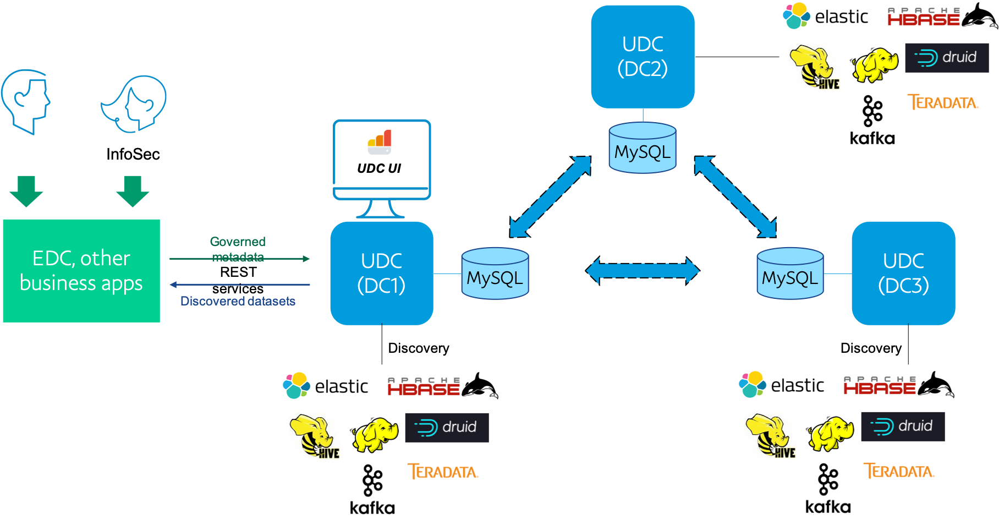
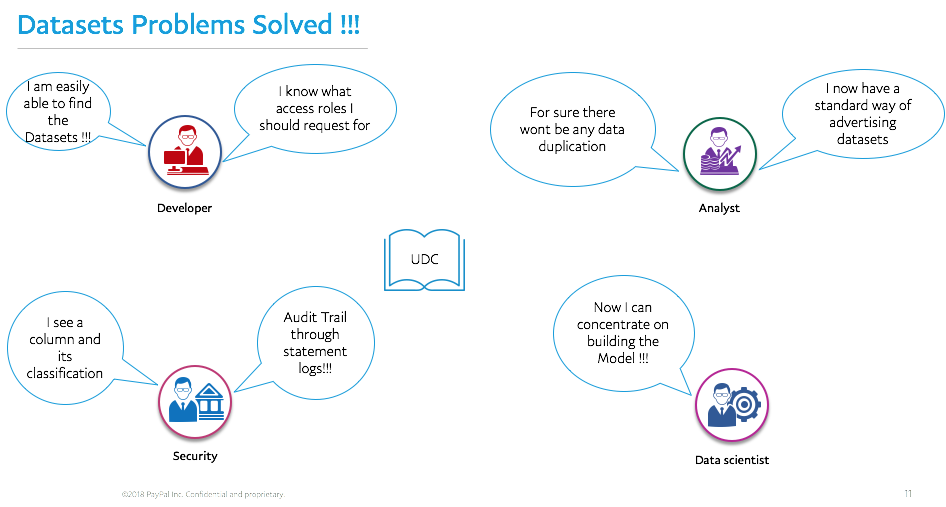

# Overview 

UDC is accessed through a web application with rich search capabilities to search for datasets, browse the catalog, view dataset details, and also manage dataset and data store metadata. 

The web application is powered by RESTful web services which manage the back-end metadata. The catalog is kept fresh through a set of discovery services which run in the background and scan all the data stores supported.  

## UDC Architecture

# 

--------------------------------------------------------------------------------------------------------------------

## Benefits
### Data Discoverability
With UDC, you can easily search across hundreds of thousands of datasets and find data across dozens of data stores like Teradata, Kafka, Hive, HBase, Elastic, MySQL, MongoDB and more
### More than technical metadata
UDC provides a wealth of information in addition to the schema: physical attributes of the data store and the dataset, data classification of various fields within a dataset, sample data for review, and the roles required for accessing the data.

--------------------------------------------------------------------------------------------------------------------

### Use Cases
* Discover what data is available within and enterprise with a simple and easy search.
* Learn which roles are needed in order to access specific datasets.
* Use UDC to access the datasets (including REST and SFTP datasets) with Gimel.

# 
